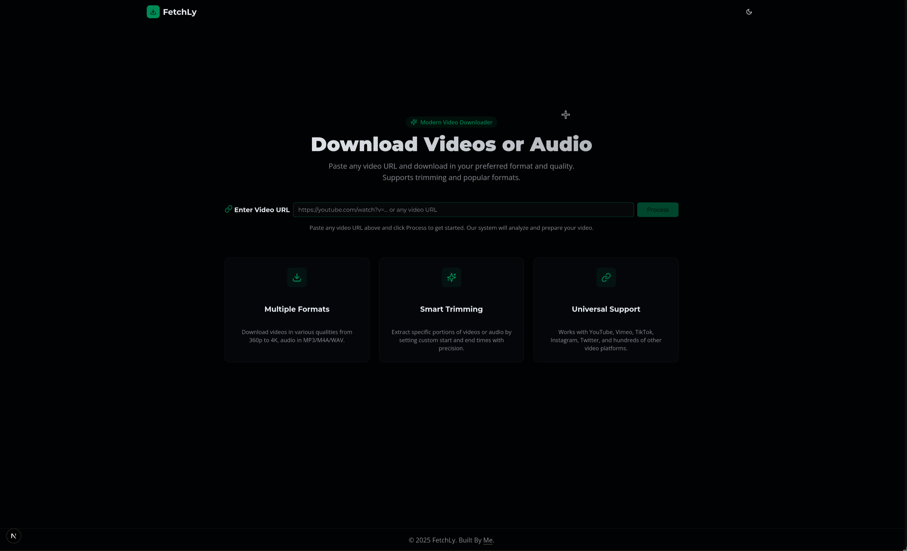
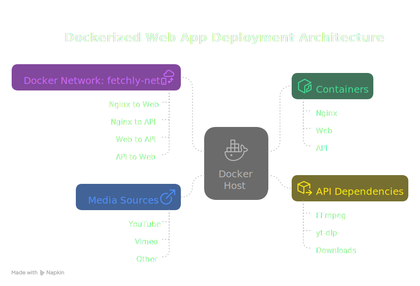

# Fetchly

Modern, fast yt-dlp wrapper with server-side trimming.

-   Backend: FastAPI + yt-dlp + ffmpeg
-   Frontend: Next.js + ShadcnUI

> Paste a URL, pick “video” or “audio”, optionally set start/end times, and Fetchly delivers only the requested section. No need to fetch the entire original file.

## Highlights

-   Server-side trimming without downloading the full source
    -   Uses yt-dlp download sections to fetch only the needed part and ffmpeg to mux/merge
    -   Time format HH:MM:SS (e.g., start 00:01:05 to end 00:03:30)
-   Smart format/quality selection
    -   Video defaults up to 1080p (configurable via quality like 720p, 1080p)
    -   Audio extraction with bitrate selection (e.g., 128k, 192k)
    -   Output formats constrained by your ffmpeg capabilities
-   Simple API and clean UI
    -   Paste URL → pick media type → optional trim → download
    -   Capability probing endpoint shows which containers/encoders are available
-   Ephemeral files, automatic cleanup



## How it works

Fetchly is a thin, pragmatic wrapper around yt-dlp and ffmpeg:

1. The server probes ffmpeg to learn which formats are actually supported on your machine.
2. For info requests, it asks yt-dlp for metadata (title, duration, thumbnail).
3. For downloads, it builds a yt-dlp command with an optional time range using `--download-sections`, so only the requested segment is retrieved when possible, then merges/muxes to your chosen container.
4. The produced file is kept for a short time (default ~5 minutes) and then cleaned up automatically.

## Prerequisites

-   Python 3.11+ (server)
-   ffmpeg installed and available on PATH
-   Node.js 18+ and pnpm (client)

## Quick start (local)

1. Start the API

```bash
cd server
python -m venv .venv && source .venv/bin/activate
pip install -r requirements.txt
uvicorn main:app --reload --host 0.0.0.0 --port 8000
```

2. Start the Web UI

```bash
cd client
pnpm install
cp .env.example .env.local   # set NEXT_PUBLIC_API_BASE_URL (e.g., http://localhost:8000)
pnpm dev
```

Open http://localhost:3000, paste a URL, pick Video/Audio, and (optionally) set start/end times.

## Docker

### Compose (API + Web + Nginx)

Spin up the full stack with one command:

```bash
docker compose up --build -d
```

-   App: http://localhost
-   API via proxy: http://localhost/api
-   API direct (exposed for dev): http://localhost:8000

The compose stack:

-   Builds `server/` into `api` (with ffmpeg installed)
-   Builds `client/` into `web` and sets `NEXT_PUBLIC_API_BASE_URL=/api`
-   Proxies through `nginx` using `nginx/nginx.conf`
-   Starts FastAPI with `--root-path /api` so generated `download_url` includes the `/api` prefix when proxied

### Individual containers

You can also run API and Web separately without Nginx.

```bash
# API
docker build -t fetchly-api ./server
docker run --rm -p 8000:8000 fetchly-api

# Web (ensure NEXT_PUBLIC_API_BASE_URL points to the API)
docker build -t fetchly-web ./client
docker run --rm -e NEXT_PUBLIC_API_BASE_URL=http://localhost:8000 -p 3000:3000 fetchly-web
```

For production without Compose, place the Web app behind a reverse proxy (Nginx/Caddy/Traefik) and route `/api` to the API. If you do so, start FastAPI with `--root-path /api` to ensure absolute URLs (like `download_url`) include the prefix.

Example Nginx server block (edit to taste):

```nginx
server {
    listen 80;
    server_name example.com;
    location /api/ { proxy_pass http://127.0.0.1:8000/; }
    location /      { proxy_pass http://127.0.0.1:3000/; }
}
```



## Configuration

Client (`client/.env.local`):

-   `NEXT_PUBLIC_API_BASE_URL` – Base URL for the FastAPI server, e.g. `http://localhost:8000` (local) or `/api` (behind a reverse proxy)

Server (environment/runtime):

-   `ffmpeg` must be installed and reachable on PATH
-   Downloads are stored under `server/downloads/` and cleaned up automatically a few minutes after each request

## API reference

Base URL: your FastAPI server (e.g., `http://localhost:8000`).

-   GET `/health`
    -   Returns server health.
-   GET `/capabilities`
    -   Returns which video/audio containers are supported by your ffmpeg build.
-   GET `/info?url=...`
    -   Returns media info: title, duration, duration_string, thumbnail, views (when available).
-   POST `/download`
    -   JSON body (fields):
        -   `url` (string, required)
        -   `media_type` ("video" | "audio")
        -   `extension` (optional, e.g., mp4, mkv, webm, mp3, m4a, opus, wav)
        -   `quality` (optional; video like `720p`; audio like `128k`)
        -   `start_time` (optional, `HH:MM:SS`)
        -   `end_time` (optional, `HH:MM:SS`)
    -   Response: `{ message, filename, download_url }`
-   GET `/download-file/{filename}`
    -   Fetch the produced file (temporary; expires after a short time).

Example (trim a 2-minute clip from 00:01:00 to 00:03:00 as mp4 up to 1080p):

```bash
curl -sS -X POST http://localhost:8000/download \
    -H 'Content-Type: application/json' \
    -d '{
        "url": "https://www.youtube.com/watch?v=...",
        "media_type": "video",
        "extension": "mp4",
        "quality": "1080p",
        "start_time": "00:01:00",
        "end_time": "00:03:00"
    }'
```

## Trimming details

-   Fetchly leverages yt-dlp’s `--download-sections` to request only the time range you specify.
-   When the source and platform allow, this avoids downloading the entire media.
-   ffmpeg is used to merge/mux streams into your desired container.
-   For audio-only extraction, `-x` is used with optional bitrate and format.

## Supported sites

Fetchly supports any site supported by yt-dlp. Some platforms may restrict range requests, private videos, or DRM-protected content. Always obtain permission and respect the site’s Terms of Service.

## Troubleshooting

-   “Unsupported media URL” – the site may not be supported by yt-dlp or the URL is malformed.
-   “Private video” / “Video unavailable” – the content is private or restricted.
-   Missing `mp4`/`m4a`/`mp3` in outputs – your ffmpeg build may lack the needed muxers/encoders; install a full ffmpeg.
-   Slow trims – some sources don’t support efficient range requests; yt-dlp may need to download larger portions.

## Development

-   Server: FastAPI app in `server/` using `yt-dlp` and `ffmpeg`.
-   Client: Next.js app in `client/` (React + Tailwind).
-   Type-check client: `pnpm -C client type-check`

Contributions are welcome. Please open an issue or PR with a clear description and reproduction steps.

## Legal

This tool is intended for personal use on content you own or have permission to download. Ensure compliance with local laws and the terms of service of the platforms you use.

## License

MIT
